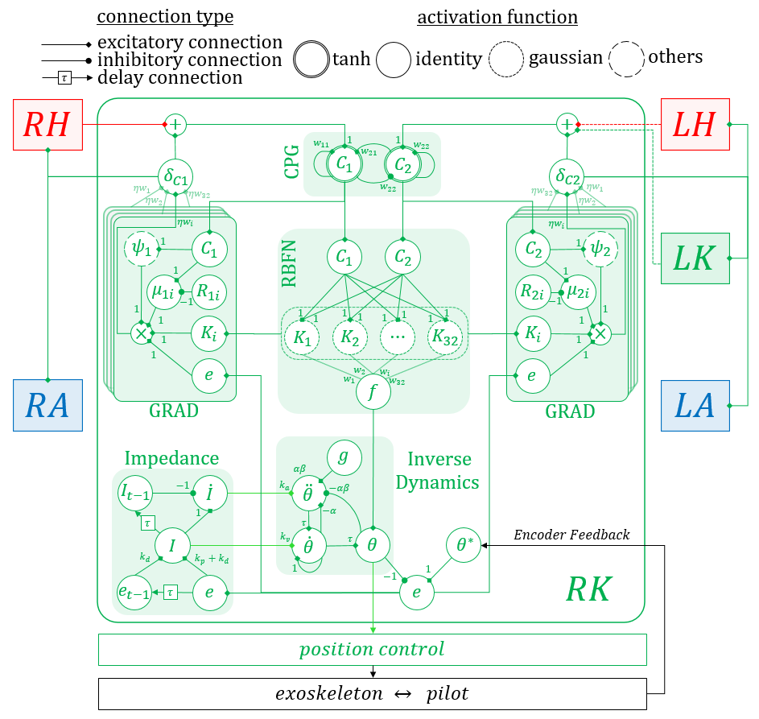
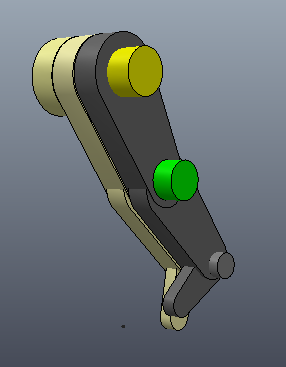
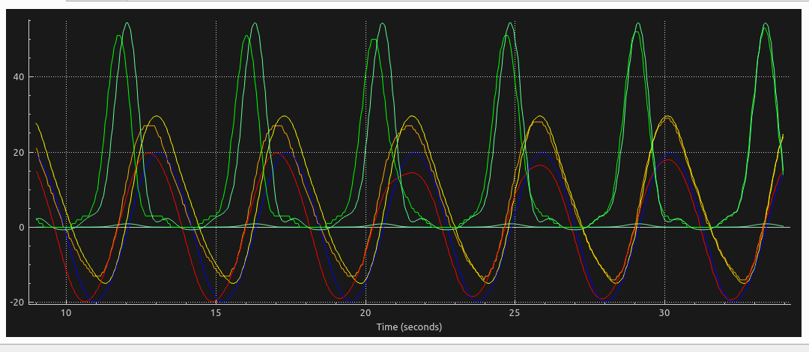

# EXOVIS project

Currently, we have two controllers:
1. [parallel controller (Book's version)](#parallel-controller)
2. [modular neural control for gait synchronization and adaptation (Zumo's version)](#neural-dynamic-movement-primitive-controller)


## Parallel Controller

See https://gitlab.com/BRAIN_Lab/biorobotics-private/exovis/-/blob/master/ParallelControl.pdf

## Modular Neural Control for Gait Synchronization and Adaptation

Each joint is controlled by a neural module. The diagram of the module is shown below. The neural module uses only positional feedback of hip and knee to synchronize with pilot's movement.

<div align="center">
	<br/ >
  	
  	<br/ >
 	Figure: diagram of a single joint neural control module.
  	<br/ >
</div>
<br/ >

The simulated exoskeleton and its pilot are shown in the figure below. In simulation, the controller is implemented for the hip (yellow) and knee (green) joints.

<div align="center">
	<br/ >
  	
  	<br/ >
  	Figure: the simulation of the exoskeleton and its pilot.
 	<br/ >
</div>
<br/ >

The result is shown below. The is a phase difference between the pilot and exoskeleton, as shown in the graph (0-30 seconds). The neural dynamic movement primitive (1) adapts the shape to the pilot's motion (using impedance controller a.k.a. reflex-based adaptation) and (2) adapt phase of the central pattern (using gradient network and dynamical state forcing central pattern generator) to produce synchronous motion, as shown in the graph (40-50 seconds).

<div align="center">
	<br/ >
  	
  	<br/ >
  	Figure: the trajectory and feedback of the hip (orange and yellow) and knee (green and light green) joints along with the central pattern of the exoskeleton (red), pilot (blue).
  	<br/ >
</div>
<br/ >

### To run the simulation

1. build the program by navigate to the catkin workspace at exovis/projects/exvis/exvis_grab/catkin_ws, run catkin_make, and add to the path by:
``` 
$ cd exovis/projects/exvis/exvis_grab/catkin_ws
$ catkin_make
$ source devel/setup.bash
```

2. open the simulation using VREP/CoppeliaSim (with ROS interface and vortex physical engine (Bullet 2.78 is acceptable, but vortex is recommended)) and open the scene at exovis/utils/simulations/exovis_oneleg_grab.ttt.

3. run the simulation.

4. run the launch file using:
``` 
$ roslaunch exvis_grab exvis_grab_simulation.launch
```
5. The provided simulation simulate the worst case scenario, in which the pilot does not even try to synchronize to the exoskeleton. Initially, the phase shift between the pilot and the exoskeleton is 10 timesteps, and the controller is operatating without gradient-based adaptation (only impedance-based adaptation). If the gradient-based adpatation gain is set by rosparameter "\exvis\eta". The exoskeleton then slowly adapts the phase system and properly synchronizes the motion to the pilot. An example of the command to set the adaptation gain is:
``` 
$ rosparam set /exvis/eta 0.2
```

### Contact

modular neural control for gain synchronization and adaptation is developed by Arthicha Srisuchinnawong, e-mail: zumoarthicha@gmail.com, arthichas_pro@vistec.ac.th
